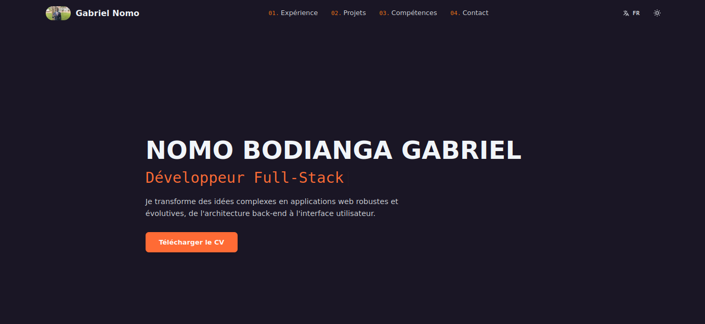

# Darelle Hapket Portfolio

This is my personal portfolio built with **Next.js**, showcasing my projects, skills, certifications, and services.

## 📸 Demo



## 🌐 Live Preview

Check it out live here: [Portfolio Live](#)

> Replace `#` with your Vercel deployment URL after publishing your portfolio.

## 🚀 Features

- Responsive design
- Smooth scrolling and active section highlighting
- Projects section
- Skills and certifications
- Contact section
- Multilanguage support
- Dark and light mode

## 🛠️ Technologies

- Next.js
- React
- Tailwind CSS
- JavaScript
- Font Awesome

## ⚙️ Installation

Clone the repository:

```bash
git clone https://github.com/DarelleHapket/my-portfolio-darelle-V1.git
```

Go to the project directory:

```bash
cd my-porfolio-darelle
```

Install dependencies:

```bash
npm install
```

Run the development server:

```bash
npm run dev
```

Open your browser and visit:

```
http://localhost:3000
```

## 🛠️ Build for Production

```bash
npm run build
npm start
```

## 📝 License

This project is licensed under the MIT License.
